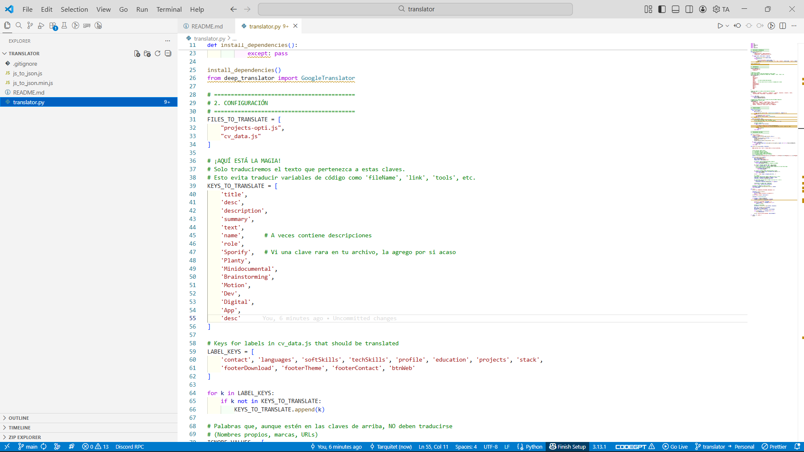

# 🌐 JSON Auto-Translator (i18n Tool)

> **Una herramienta de escritorio rápida y sencilla para automatizar la traducción de archivos de localización JSON.**

**JSON Auto-Translator** es una aplicación por terminal ligera escrita en Python diseñada para ayudarme a traducir rápidamente algunos archivos .js o .json durante el desarrollo de mi portafolio personal (puedes visitarlo en mi perfil). Te permite colocar los archivos desde las listas dentro del programa, para después ejecutarlo.



## ✨ Características Principales

- **🔒 Traducción Segura (Solo Valores):** La herramienta es inteligente; traduce únicamente los _valores_ del JSON y mantiene las _claves_ originales para que tu código no se rompa.
- **⚡ Procesamiento Multihilo:** La interfaz gráfica (GUI) no se congela mientras se traducen archivos grandes, gracias a su arquitectura multihilo.
- **📊 Barra de Progreso en Tiempo Real:** Visualiza exactamente el avance de la traducción, ítem por ítem.
- **🤖 API Gratuita:** Utiliza la librería `googletrans` (API de Google Translate) sin necesidad de configuraciones de pago.
- **🖥️ Interfaz Intuitiva:** Interfaz gráfica nativa construida con Tkinter, lista para usar sin usar la terminal.

---

## ⚙️ Requisitos e Instalación

**Requisitos del sistema:**

- Python 3.8 o superior.

### 1. Clonar o descargar el repositorio

```bash
git clone [https://github.com/tu-usuario/json-auto-translator.git](https://github.com/Tarquitet/web-translator.git)
cd translator
```

2. Instalar dependencias

Es muy importante instalar la versión candidata (rc1) de googletrans, ya que las versiones estables anteriores presentan errores de conexión con la API actual de Google. Pero no te preocupes, el mismo programa instala las dependencias por ti.

3. Su uso
   Reemplaza los nombres de los archivos a traducir. Indica las keys que lleven esos archivos json o javascript, agrega en la lista los elementos que NO quieres que sean traducidos.

⚖️ Licencia y Créditos

Este proyecto utiliza las siguientes tecnologías de código abierto:

Python (tkinter, threading, json): Librerías estándar.

Googletrans: Librería no oficial de Python para la API de Google Translate.
Desarrollado para agilizar flujos de trabajo de localización (i18n).
